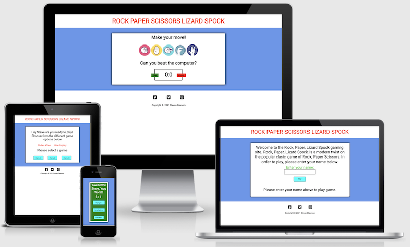
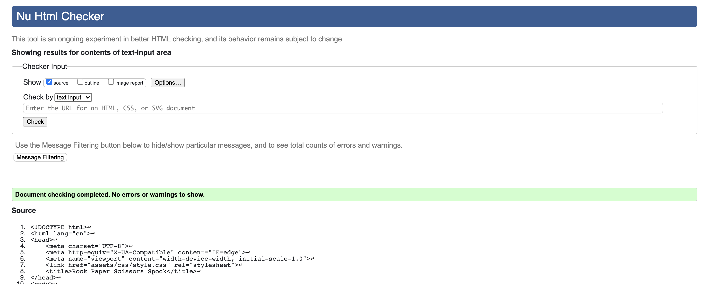
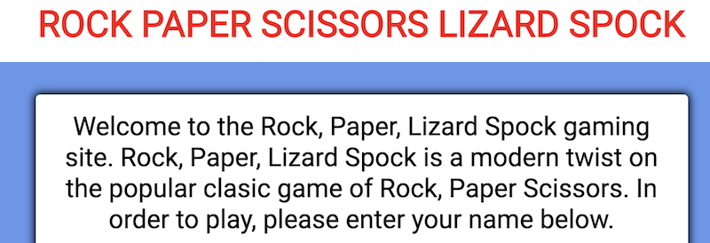
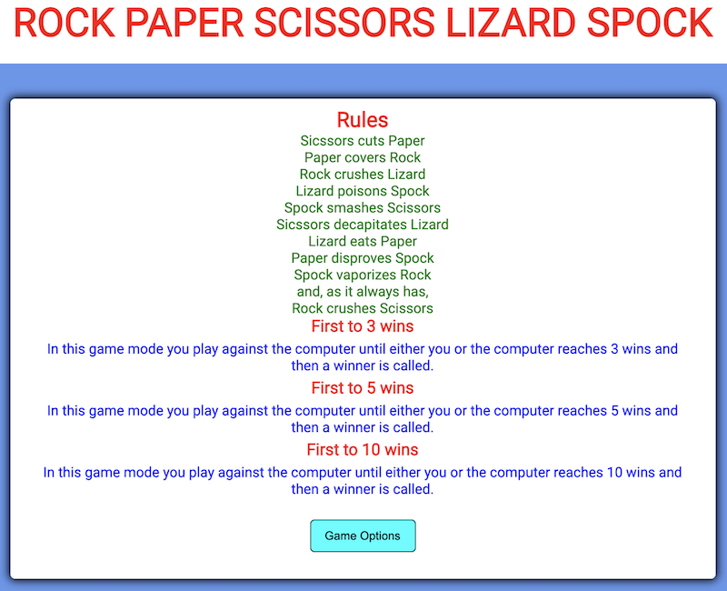
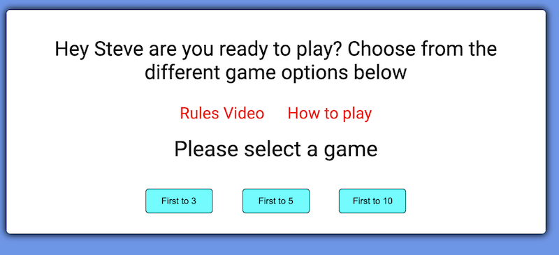

# Rock Paper Scissors Lizard Spock

[View website in Github](url:https://https://steven-dawson18.github.io/Rock-Paper-Scissors-Spock-Reloaded/)

## Aim
The aim of this website is to provide an online game to users that want a few minutes to take their mind off everyday life and enjoy a game that is based on the element of chance.

## Description
This website is to provide users with a fun and interactive gaming experience. The game is a fun adaptation of the popular game of Rock Paper Scissors which adds to the excitement of the game. Those users who are familiar with the program Big Bang Theory will be aware of the game and for those who are not a video is linked in the rules to play the game.

## Business Goals
* Excellent UX to keep visitors on the site engaged in the game.
* Provide links to the business social media pages.
## Client Goals
* Visitors are looking for and exciting and engaging game to play.
* Easy to understand and intuitive website.

## Client Stories

1. As an new visitor to the website, I want to intuitively understand what the site is about.
2. As an new visitor to the website, I want to be able to view the rules of the game.
3. As a new visitor to the website, I would like the rules to be eplained to me.
4. As a user playing the game, I would like to view the current score.
5. As a user playing the game, I would like to know if I won or Lost on the last turn.
6. As a user playing the game, I would like to know if I won or Lost on the game.
7. As participant, I want to be able to follow the events on social media so I can keep up to date with the latest news and games.

## Features
* User interactivity by using the users name to respond.
* Socring system which is easy to follow.
* Explanation of the game rules.
* Link to video explaining the game rules.
* Ability to play against the computer.
* Game Over winner announcement.

## Testing

* During the testing process I have used the Google Chrome Developer Tools to view each aspect of the site in different widths to make sure that it is responsive to screen size change and also viewed on the different divices such as ipad, iphone 6 and iphone 6 plus to make sure that each element works as it should.
* The project has also been published to GItHub Pages and viewed in different screen widths to check the responsiveness of the site and make sure all links work as they should. Below are the different testing processes I have put the site through:

### Validatior Testing

* HTML issues highlighted
* The first time I put the code into the validator it came up with an error I have since corrected. This was as follows:
* Stray closing div tag.

* HTML
No errors were returned when passing through the official W3C validator once the corrections had been made. Images of validation pass are below:

* CSS validator highlighted no errors.

No errors were found when passing through the official (Jigsaw) validator.

* Javascript
When put through JSHINT it highlighted that there were a few missing semicolons which have been fixed.

JSHINT Metrics
There are 29 functions in this file.

Function with the largest signature take 2 arguments, while the median is 0.

Largest function has 10 statements in it, while the median is 2.

The most complex function has a cyclomatic complexity value of 26 while the median is 1.

### Testing different in browsers

* Chrome browser - All site works well

* Safari browser -  All site works well

* Firefox browser - All site works well

### Testing User Stories
1. As an new visitor to the website, I want to intuitively understand what the site is about.

The opening page gives the user the information they need to know what the site is about.
2. As an new visitor to the website, I want to be able to view the rules of the game.

The link to the game rules are easily seen on the options page and clearly explained on the rules page. There is also a vidoe to help further explain the rules.
3. As a new visitor to the website, I would like the rules to be eplained to me.

A link to the video which explains the rules is found on the options page and will take the user to youtube in a new tab.
4. As a user playing the game, I would like to view the current score.
5. As a user playing the game, I would like to know if I won or Lost on the last turn.
6. As a user playing the game, I would like to know if I won or Lost on the game.
7. As participant, I want to be able to follow the events on social media so I can keep up to date with the latest news and games.

## Unfixed Bugs

## Deployment

The site was deployed to GitHub pages. The steps to deploy are as follows:
In the GitHub repository, navigate to the Settings tab
From the source section drop-down menu, select the Master Branch
Once the master branch has been selected, the page will be automatically refreshed with a detailed ribbon display to indicate the successful deployment.

The live link can be viewed here: https://https://steven-dawson18.github.io/Rock-Paper-Scissors-Spock-Reloaded/

## Credits

### Media

### Content