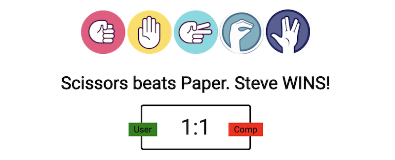
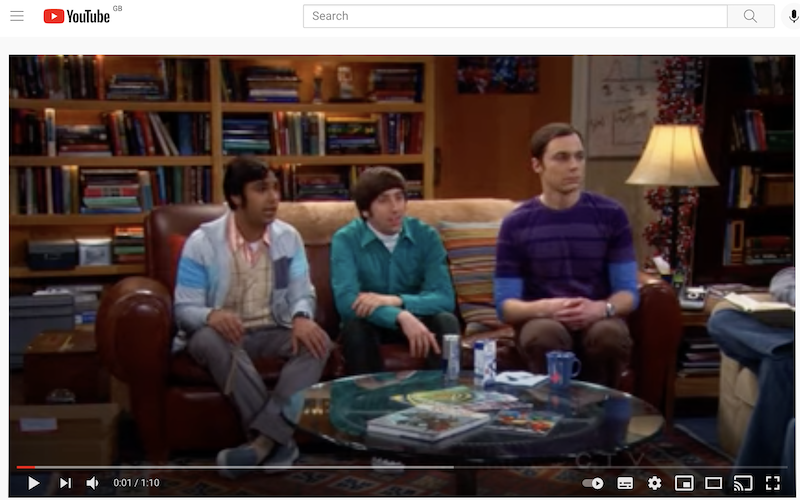

# Rock Paper Scissors Lizard Spock

[View website in Github](url:https://https://steven-dawson18.github.io/Rock-Paper-Scissors-Spock-Reloaded/)

## Aim
The aim of this website is to provide an online game to users that want a few minutes to take their mind off everyday life and enjoy a game that is based on the element of chance.

## Description
This website is to provide users with a fun and interactive gaming experience. The game is a fun adaptation of the popular game of Rock Paper Scissors which adds to the excitement of the game. Those users who are familiar with the program Big Bang Theory will be aware of the game and for those who are not a video is linked in the rules to play the game.

## Business Goals
* Excellent UX to keep visitors on the site engaged in the game.
* Provide links to the business social media pages.
## Client Goals
* Visitors are looking for and exciting and engaging game to play.
* Easy to understand and intuitive website.

## Client Stories

1. As an new visitor to the website, I want to intuitively understand what the site is about.
2. As an new visitor to the website, I want to be able to view the rules of the game.
3. As a new visitor to the website, I would like the rules to be eplained to me.
4. As a user playing the game, I would like to view the current score.
5. As a user playing the game, I would like to know if I won or Lost on the last turn.
6. As a user playing the game, I would like to know if I won or Lost on the game.
7. As participant, I want to be able to follow the events on social media so I can keep up to date with the latest news and games.

## Features
* User interactivity by using the users name to respond.

By responding to the user using their name, the game has a personal feel to it, making you feel more involved in the experience. This is used throughout the game on the winner and loser page.

* Scoring system which is easy to follow.

The scoreboard is easy to understand with the labels stating which score is the users and the computers.

* Explanation of the game rules.

The rules are clearly explained on a seperate page which takes the user back to the options page once they are satisfied. The rules page explaines the rules of the game and the three game options to choose from.

* Link to video explaining the game rules.

If the user requires a verbal explanation of the rules they can click on the link on the options page. This will open youtube in a new tab on the users device.

The video is an fun explanation of the rules from the characters from the popular tv show Big Bang Theory.

* Ability to play against the computer.

The user is pitted against the computer in this game of chance. For each turn the user makes the computer randomly takes its turn and the result is displayed to the user in the response statement above the scoreboard.

* Game Over winner announcement.

When the selected game has run its course by either the user or computer reaching the winning score, the game will announce if the user has won or lost and display a mesasage with the final score. The useer will have three options at this point. To play the game again, go back to the options page to select a different game or end the game, taking the user to the start page where a new user can input their name and play.

## Wireframe Mock Ups

* Here is wireframe mock up of the planned game site on a desktop:

* Here is wireframe mock up of the planned game site on a Tablet device:

* Here is wireframe mock up of the planned game site on a Mobile device:

## Testing

* During the testing process I have used the Google Chrome Developer Tools to view each aspect of the site in different widths to make sure that it is responsive to screen size change and also viewed on the different divices such as ipad, iphone 6 and iphone 6 plus to make sure that each element works as it should.
* The project has also been published to GItHub Pages and viewed in different screen widths to check the responsiveness of the site and make sure all links work as they should. Below are the different testing processes I have put the site through:

### Validatior Testing

* HTML issues highlighted
* The first time I put the code into the validator it came up with an error I have since corrected. This was as follows:
* Stray closing div tag.

* HTML
No errors were returned when passing through the official W3C validator once the corrections had been made. Images of validation pass are below:

* CSS validator highlighted no errors.

No errors were found when passing through the official (Jigsaw) validator.

* Javascript
When put through JSHINT it highlighted that there were a few missing semicolons which have been fixed.

JSHINT Metrics
There are 29 functions in this file.

Function with the largest signature take 2 arguments, while the median is 0.

Largest function has 10 statements in it, while the median is 2.

The most complex function has a cyclomatic complexity value of 26 while the median is 1.

### Testing different in browsers

* Chrome browser - All site works well

* Safari browser -  All site works well

* Firefox browser - All site works well

### Testing User Stories
1. As an new visitor to the website, I want to intuitively understand what the site is about.

The opening page gives the user the information they need to know what the site is about.
2. As an new visitor to the website, I want to be able to view the rules of the game.

The link to the game rules are easily seen on the options page and clearly explained on the rules page. There is also a vidoe to help further explain the rules.
3. As a new visitor to the website, I would like the rules to be eplained to me.

A link to the video which explains the rules is found on the options page and will take the user to youtube in a new tab.
4. As a user playing the game, I would like to view the current score.

On the game page there is a clear scoreboard which will let the user know the current score.
5. As a user playing the game, I would like to know if I won or Lost on the last turn.
As can be seen in the previous image, a message is relayed to the user letting them know if they won, lost or drew the last turn.
6. As a user playing the game, I would like to know if I won or Lost on the game.

Once eight the user or the computer reaches the winning score, the user is shown either the winning or losing page with the final score displayed with a winning or losing message.
7. As participant, I want to be able to follow the events on social media so I can keep up to date with the latest news and games.

At the bottom of each page the social media links are able to be clicked to open in a new tab"

## Bugs

When testing the responsiveness of the site a few bugs were found and corrected.
* The user input on the fist page of the site strayed out of the containing div. To fix this I added a max width to the input.
* The scoreboard strayed out of the container div. To fix this I added a max width to the div and reduced the font size of the labels.
* From testing the site I noticed that the game would start if the useer input a space and nothing else. To fix this I added the trim method to the input.
* The user buttons for the game had a strange alignment on smaller screen sizes. To fix this I reduced the size of the images and removed the margin between them.
* When I put the index.html into the validator, an extra closed div element was found. To solve this I removed the extra close div element.
### Unfixed Bugs

* There are no unfixed bugs in this game.

## Deployment

The site was deployed to GitHub pages. The steps to deploy are as follows:
In the GitHub repository, navigate to the Settings tab
From the source section drop-down menu, select the Master Branch
Once the master branch has been selected, the page will be automatically refreshed with a detailed ribbon display to indicate the successful deployment.

The live link can be viewed here: https://steven-dawson18.github.io/Rock-Paper-Scissors-Spock-Reloaded/

## Credits

### Media
#### The photos used on the home and sign up page are from Google Images and linked to original site:
Rock image - https://www.google.com/
https://encrypted-tbn0.gstatic.com/images?q=tbn:ANd9GcRfMQDCxJilPcL5L9-wHJTBAVjOB7J9z2EIfenDw7MY8Dg-BQXhVCRZfTerHjSBdaF0UBM&usqp=CAU
Paper image - https://www.google.com/
https://encrypted-tbn0.gstatic.com/images?q=tbn:ANd9GcR1S9zQk2q592O-oELT4Wz-Vk9r1a6nf-SeFvm7mS0HkeMhJ_X7_VROraqoYY3LlZpOL44&usqp=CAU
Scissor image - https://www.clipartmax.com/png/middle/428-4288836_your-hand-hand-clipart-png-rock-paper-scissors.png
Lizard image - https://www.google.com/
https://encrypted-tbn0.gstatic.com/images?q=tbn:ANd9GcT2nKCD7M1dJ1NjbftErHvA-ZTkqAhv-Leyui9xlGPgijHHWRIHOdzzFt1pfJClMX6_p9g&usqp=CAU
Spock image - https://www.google.com/
https://w7.pngwing.com/pngs/522/764/png-transparent-lizard-spock-rock-paper-scissors-vulcan-salute-others-purple-blue-game-thumbnail.png

### Content
Inspiration for the project was taken from a youtube tutorial by freecodecamp.org on rock paper scissors- https://www.youtube.com/watch?v=jaVNP3nIAv0

Javascript code was used from this tutorial as inspiration and adapted for use in my project and have been mentioned in the comments in the code as well as below.

* userButtons Function

* game function